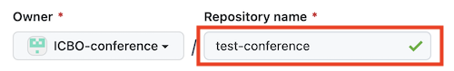
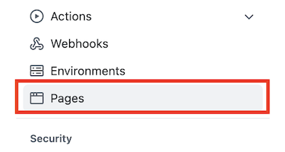
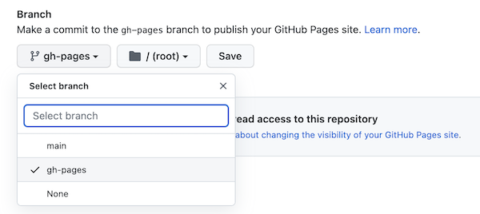

# ICBO Template
This repository is a template for creating ICBO conference repositories. Instructions for using this template to create a specific ICBO conference repository is included below. For more speci instructions, see the [GitHub instructions](https://docs.github.com/en/repositories/creating-and-managing-repositories/creating-a-repository-from-a-template) for how to create a repository from a template.

Once your repository has been created, you are free to configure your ICBO repisitory as you desire. Any suggestions or contributions on how to make the instructions for (this) the template repository are welcome. 

## Using the template

To create your repository, start by clicking the **Use this template** button:


Next, fill in the name of your repository:

 

Be sure to mark your repository as **Public** and **Include all branches**:


This will deploy the website on the `gh-pages` branch of your repository. If for some reason the deployment branch is not in your repository, you can add it by going into the repository settings:


selecting the **pages** content:



and choosing/adding the branch on which to deploy the website:




## Add github.io website  
To make website available, you have to associate the repository with a `github.io` website (e.g., [https://icbo-conference.github.io/icbo2022](https://icbo-conference.github.io/icbo2022)). The is done be clicking on the settings icon next to **About**:  


and then setting the necessary information for **Webpage**:  


## Github mkdocs actions configuration

The template is set up to use [mkdocs](https://www.mkdocs.org/) to configure a `github.io` website. The deployment of the website is controlled using the GitHub action `.github/workflows/build-deploy-documentation.yaml`. The GitHub action has been configured to run if any changes are made to mkdocs.yaml, files in the `docs/`, `docs/images/`, `docs/papers/`, `docs/slides/`, or `docs/flash-talks/` directories, or after a pull request is merged. Using pull requests allows you to closely track changes made to the repository (if desired). The [icbo2022 conference repository](https://github.com/ICBO-conference/icbo2022) is an example of how a repository can be configured using [mkdocs](https://www.mkdocs.org/).

## Default content 

The template provides a set of default webpages in the `docs/` folder. These include:  
```
call-for-submissions.md  
co-organizers.md  
contact-information.md  
icbo-hotels.md  
icbo-registration.md  
icbo-schedule.md  
icbo-travel.md  
keynote-speakers.md  
papers-and-poster-abstracts.md  
proceeding-publication-requirements.md  
program-committee.md  
submit-jbms-icbo.md  (optional)
workshops-and-tutorials.md  
```
The content for the landing page is in the `index.md` file. You can add or remove content as needed (see below).  

The website navigation menu is controlled by associating menu labels with markdown files in `mkdocs.yml` file.  

## Editing website content 

The website content is contained in the `docs/`, `docs/images/`, `docs/papers/`, `docs/slides/`, and `docs/flash-talks/` directories. Editing any of the `*.md` files or adding/changing an image **should** fire off an action to build and deploy the website. This GitHub action can be checked by navigating to the `Actions` page:


and verifying that the changes fired off an action. For example, here is an action that started as a result of an update the to the `call-for-submissions.md`:

  

After the action has finished running (it will have green check), verify that the edits are displayed on the website. 

## Adding new webpages

Adding new webpage takes two steps:

1. Create the new `md` file in the `docs/` directory.
2. Edit the `nav` section of `mkdocs.yml` to reference the new document and its title.

## Adding new images

A new image is added to the website is done by simply saving a the image to the `docs/images/` directory. However, referencing the image from the `md` file is a bit nuanced.  

If you reference the image using markdown syntax, you include the `images` directory in the path to the images. For example, in the `docs/call-for-submissions.md` document, the reference to a image is done like so:
```

```

However, if you are customizing the image with an HTML `` tag, you use the `../images` directory in the path to the image. For example, `src='../images/test-image.png'` is the path needed when setting the margins of an image like this:
```

```
The reason for this has to do with how `read the docs` processes images, but I don't know the details of why.

## Manually deploying the website 

If (for some reason) the GitHub action does not fire, you can manually run it. First, on the `Actions` page, select the `Build and Deploy Static Mkdocs Documentation` workflow.  


Next, click on the `Run workflow` button.  


  


Once the workflow starts running, you will see yellow dot beside the workflow name.  


After the workflow, completes you will see a green check beside the workflow name.


Verify that the edits are displayed on the website. 

