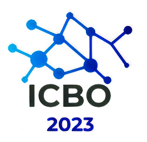
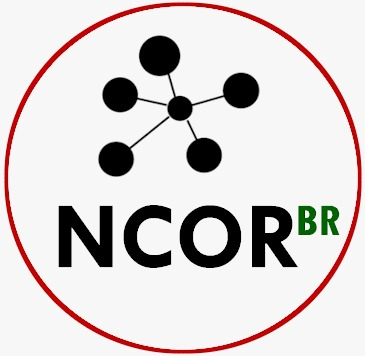

<!-- # Organization – ICBO 2023  -->

  

<!--   -->
# Organization – ICBO 2023

## General Chair
* Fernanda Farinelli (University of Brasília, Brazil)

## Local Chair
* Dalton Lopes Martins (University of Brasilia, Brazil)

## Program Committee Chairs
* Luis M. Machado (Centre for Interdisciplinary Studies, University of Coimbra) 
* Mathias Brochhausen (University of Arkansas for Medical Sciences, USA) 

## Workshops/tutorial Chairs
* Asiyah Lin (National Institutes of Health (NIH), USA)
* Andrey Soares (University of Colorado Anschutz Medical Campus, USA)

## Journal of Biomedical Semantics ICBO Thematic Series Option
* Stefan Schulz (Medizinische Universität Graz, Austria)
* Amanda Damasceno de Souza (FUMEC University, Brazil)

## Proceedings Chairs  
* Jeanne Louize Emygdio (Pontifical Catholic University of Minas Gerais, Brazil)
* Eduardo Ribeiro Felipe (Federal University of Itajubá, Brazil)
  
## Publicity Chairs 
* Amanda Damasceno de Souza (FUMEC University, Brazil)  
* Edcleyton Bruno Fernandes da Silva (Instituto Federal de Alagoas)  
  
## Website Chair 
* Eduardo Ribeiro Felipe (Federal University of Itajubá, Brazil)
* William Duncan (University of Florida, USA)

<!-- ## Sponsor organizations
* TBD -->

## Administrative Support
<!-- * [*Faculty of Information Science at the University of Brasilia*](http://www.fci.unb.br/)  -->
<!--  -->

  <a href="http://www.fci.unb.br/"><i>Faculty of Information Science at the University of Brasilia</i></a> 
  

   
  
   
<i>Brazilian National Center for Ontological Research - <a href="https://ncor-brasil.org/sobre-o-ncor-br/">NCOR-BR</i></a>

  
  

## Organization Support  

  <a href="https://alma.hsl.org.br/"><i>Alma Sírio-Libanês</i></a> 
  

## Volunteer Support  
* Alexander Diehl (University at Buffalo, USA)
* Yongqun "Oliver" He (University of Michigan, Ann Arbor, MI, USA)
* Marcia Ito (FATEC-SP) 
