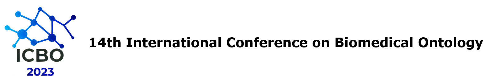

<!-- # ICBO 2023: International Conference on Biomedical Ontology -->
<!-- #  14ª International Conference on Biomedical Ontology -->

  

Theme of ICBO 2023: **"The role of Ontologies in Artificial Intelligence and Machine Learning"**.

- ICBO 2023 will be held with the 16th Seminar on Ontology Research in Brazil – [ONTOBRAS 2023](https://www.inf.ufrgs.br/ontobras/) 

  

## Conference Dates
- **August 28th to September 1st** (Monday-Friday)
- **Workshops and tutorials**: August 28-30, 2023 (until noon of day 30) 
- **Main conference**: August 30 (afternoon) - September 01, 2023 

## [Keynote Speakers](keynote-speakers.md)
- [Barry Smith](https://www.buffalo.edu/cas/philosophy/faculty/faculty_directory/smith-b.html) - University at Buffalo  
- [Maurício Barcellos](https://mba.eci.ufmg.br) - Federal University of Minas Gerais  

## Location 

The **14th International Conference of Biomedical Ontology (ICBO 2023)** will be held <!-- in 2023 --> at the *Campus Darcy Ribeiro of University of Brasilia*, <!-- [UNB](https://international.unb.br) --> Brasilia, DF, Brazil. 

<!--  -->

    
  <a href="https://international.unb.br/"><i>University of Brasilia</i></a> 
  Campus Universitário Darcy Ribeiro, Brasília-DF | Postal Code 70910-900

<!-- **Note:** This meeting will be held in a hybrid format that includes both in-person and virtual participation. -->

## Venue
<!-- [UnB](https://international.unb.br), University of Brasilia -->
<pre align="center">
<a href="https://www.google.com.br/maps/place/Universidade+de+Bras%C3%ADlia+-+Campus+Darcy+Ribeiro/@-15.7658436,-47.8721751,15z/data=!4m6!3m5!1s0x935a3bba813cf97b:0xed2c4932e4690218!8m2!3d-15.7658436!4d-47.8721751!16s%2Fg%2F11c0q0q13j?hl=pt-BR" target="_blank">UnB address</a>

Campus Darcy Ribeiro
Asa Norte - Brasília-DF
</pre>

## Conference Videos

A latest playlist of the conference's recordings is available on [YouTube](https://www.youtube.com/channel/UCUT0MwXxAFnekhsSJVmHTJw/playlists).  

<!-- ## Conference Feedback

This year's ICBO conference has ended. See this [PDF](survey/ICBO2022-survey-results-final.pdf) to see participant feedback. -->

<!--  -->
## 

	 </img>

