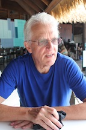

# Keynote Speakers

## Barry Smith 

 

AI and the Ontology of Systems

[WHY MACHINES WILL NEVER RULE THE WORLD](https://buffalo.app.box.com/v/AI-Without-Fear)

Barry Smith, the Founder of the ICBO conference series, is one of the most widely cited contemporary philosophers. His pioneering work on the science of ontology led to the establishment of Basic Formal Ontology (BFO), which is the most commonly adopted top-level ontology development framework. In 2021, BFO was approved as an ISO standard top-level ontology (in ISO/IEC:21838-2). This makes it the first example of a piece of philosophy that has been elevated to the level of an international standard. His work led also to the formation of the OBO (Open Biomedical Ontologies) Foundry, a suite of interoperable ontology modules designed to support information-driven research in biology and biomedicine. The methodology underlying BFO and the OBO Foundry is today being applied in a range of different domains, including military intelligence, industrial engineering and quantum physics. 
  
## Maurício Barcellos   

 

A BFO-based Framework for healthcare corporations  

PhD in Information Science with Post-doctorate at the State University of New York (US), researcher at the Ontology Research Group (US), leader of the ReCol group (BR), CNPq Level 2 Productivity Scholar. Mauricio is currently a professor at the Federal University of Minas Gerais (UFMG) where he conducts research on Knowledge Representation and Applied Ontology. He is the author of more than 200 national and international publications on the subject.  

  